# Infrastructure Provisioning with Terraform on AWS

This project aims to design and implement infrastructure provisioning leveraging AWS Cloud through Terraform for the final project.

## Architecture Overview

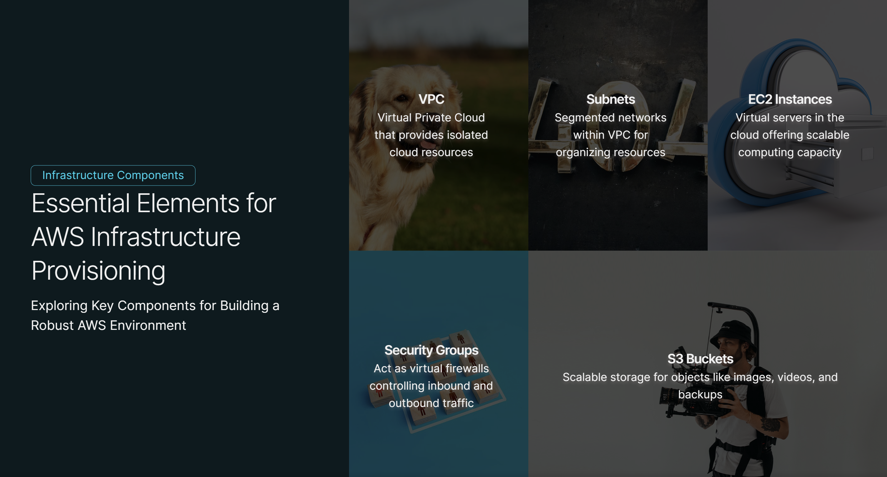
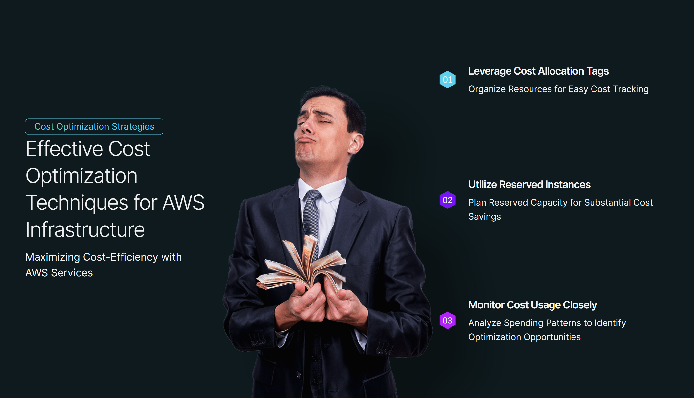

## Terraform Basics

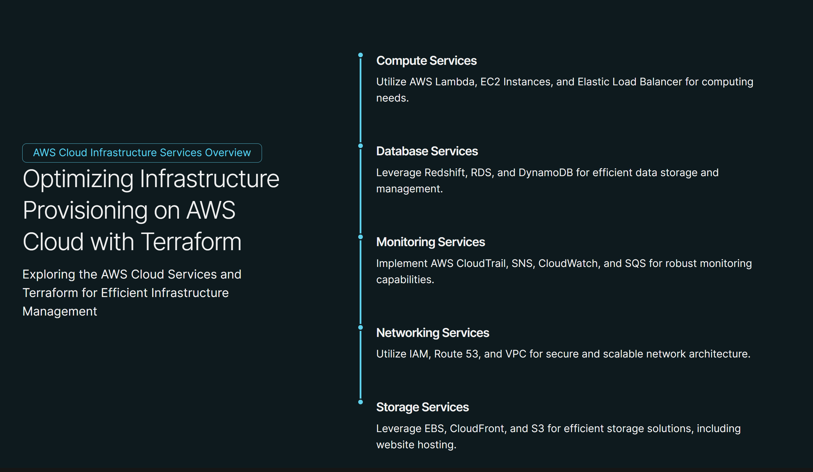

## AWS Infrastructure with Terraform

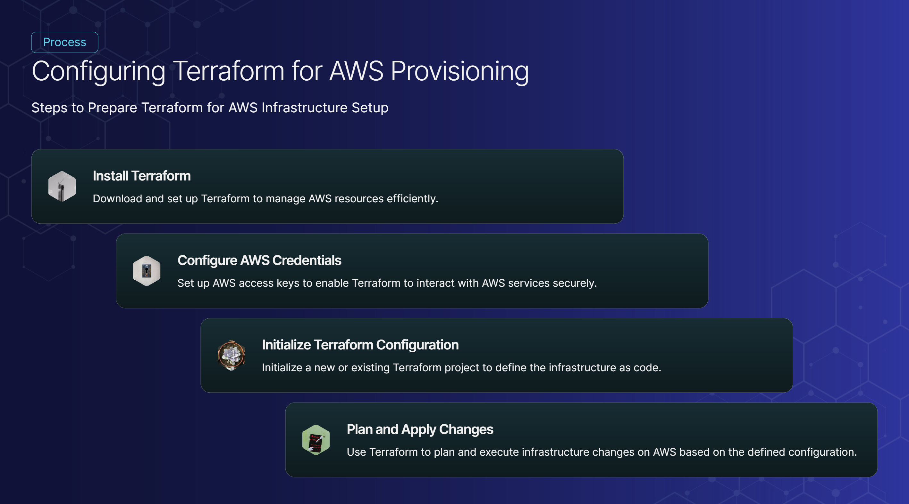
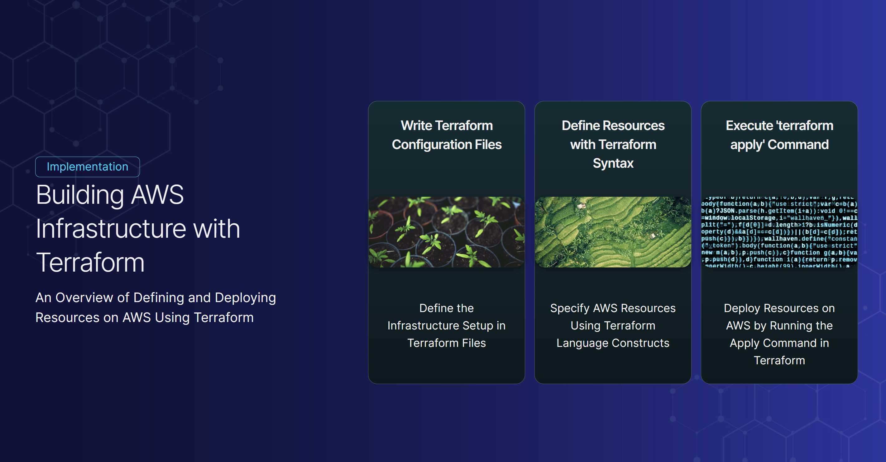

## Basic Concepts for Working in Terraform

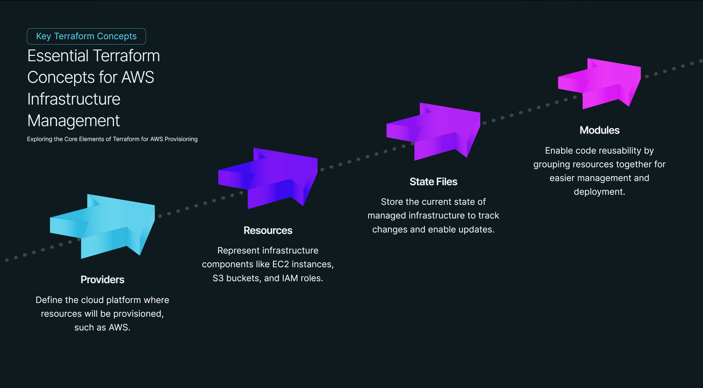

## Compute Services

- **AWS Lambda**: Serverless computing for executing code without provisioning or managing servers.
- **EC2 Instance**: Scalable compute capacity in the cloud.
- **Elastic Load Balancer (ELB)**: Automatically distributes incoming application traffic across multiple targets.

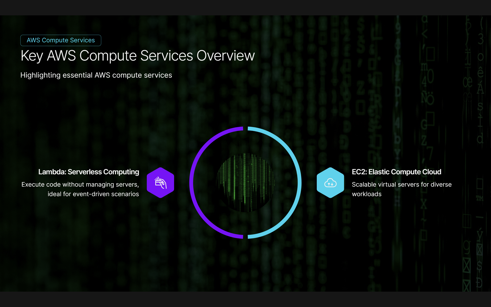

## Database Services

- **Redshift**: Fully managed, petabyte-scale data warehouse service.
- **RDS (Relational Database Service)**: Managed database service for relational databases.
- **DynamoDB**: Fully managed NoSQL database service.

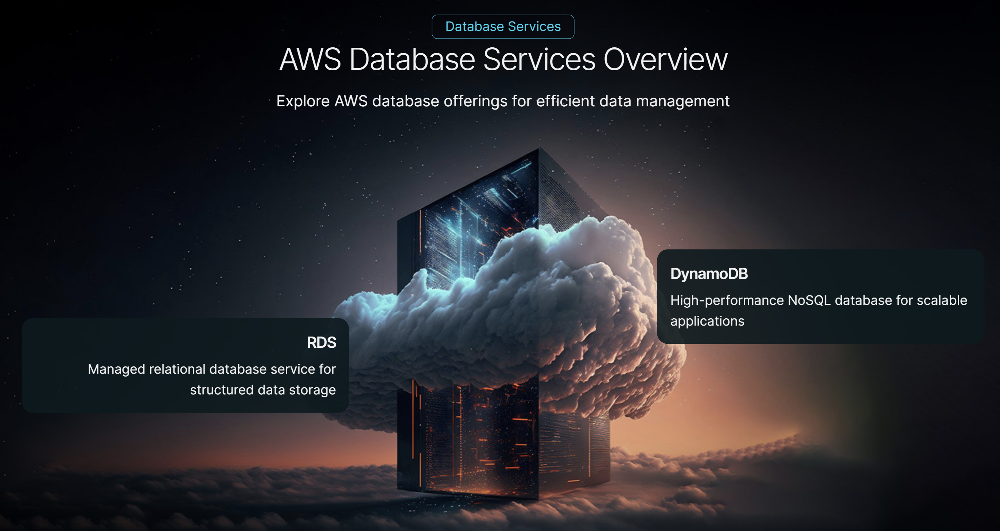

## Monitoring Services

- **AWS CloudTrail**: Records AWS API calls for your account and delivers log files to you.
- **AWS Config (with SNS)**: Enables you to assess, audit, and evaluate the configurations of your AWS resources.
- **AWS CloudWatch**: Monitoring and observability service for AWS cloud resources and applications.

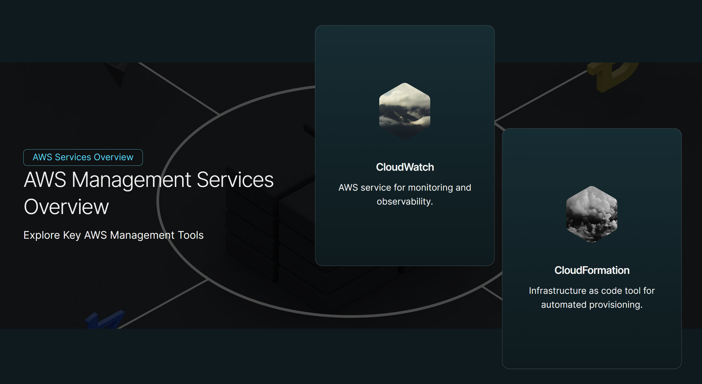

## Networking Services

- **IAM (Identity and Access Management)**: Securely control access to AWS services and resources.
- **Route 53**: Scalable DNS web service designed to route end users to internet applications.
- **VPC (Virtual Private Cloud)**: Provision a logically isolated section of the AWS cloud where you can launch AWS resources in a virtual network.

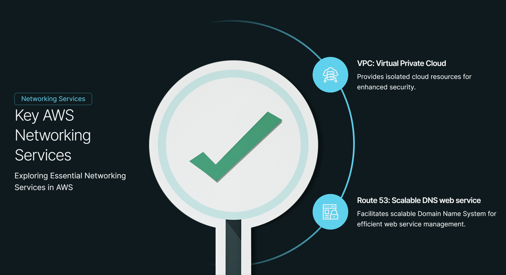

## Storage Services

- **EBS (Elastic Block Store)**: Persistent block storage volumes for use with EC2 instances.
- **CloudFront**: Content delivery network (CDN) service for securely delivering data, videos, applications, and APIs to customers globally.
- **S3 (Simple Storage Service)**: Object storage service for hosting static websites, storing data for analytics, and more.

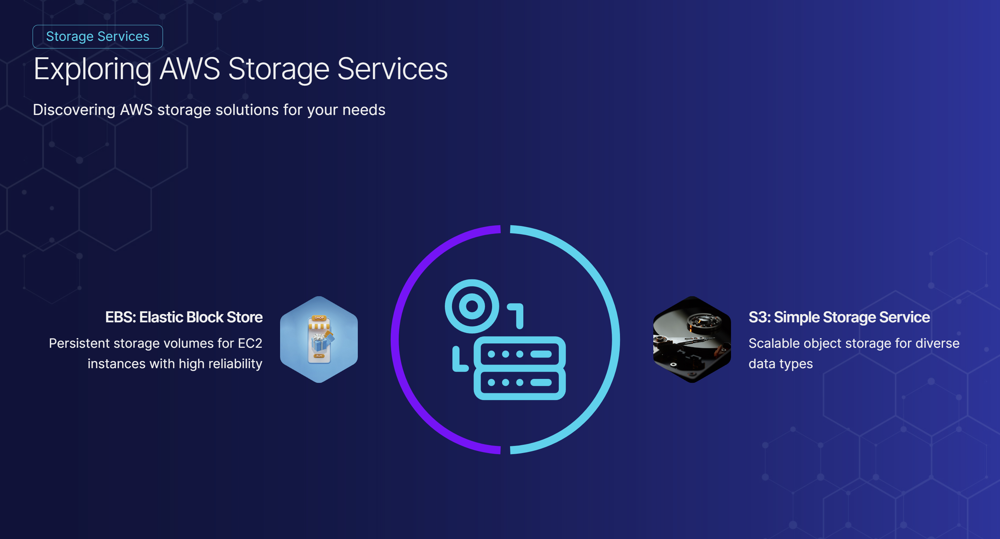

## Contributors

- Parvesh
- Jasvir Singh 
- MD Sakib
 
## License

This project is licensed under the MIT License.
